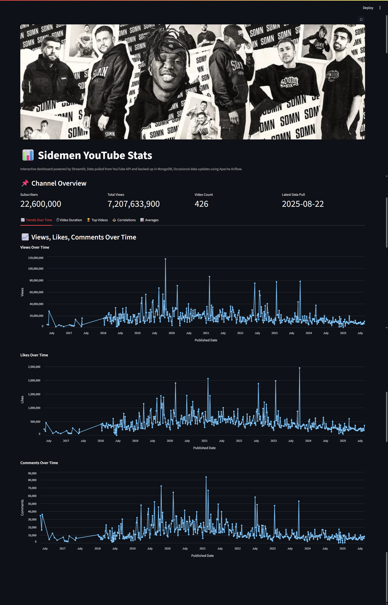

# 📊 Sidemen YouTube Channel Analytics  

This project is a **data pipeline + analytics dashboard** that automatically collects, stores, and visualizes video statistics from the [Sidemen YouTube channel](https://youtube.com/@sidemen?si=iYEr-LMoyxF1D_EB).  

- ⏰ Runs **every Sunday** using Apache Airflow (in Docker)  
- 🎥 Fetches only **newest video data** via YouTube Data API v3  
- ☁️ Stores structured results in **MongoDB Atlas**  
- 📊 Provides an **interactive Streamlit dashboard** for exploring trends  

---

## 🚀 Project Overview  

The workflow is fully automated:  

1. **Data Ingestion**  
   - Airflow DAG fetches Sidemen video data (title, publish date, views, likes, comments, etc.).  
   - Only **new videos** since the last run are collected.  

2. **Data Transformation**  
   - API responses are flattened into structured JSON.  
   - Cleaned data is prepared for storage.  

3. **Data Storage**  
   - Transformed data is stored in a **MongoDB Atlas collection**.  

4. **Analytics Dashboard**  
   - A **Streamlit dashboard** lets you explore:  
     - Views, likes, comments over time  
     - Top-performing videos  
     - Engagement trends  

---

## 🛠 Tech Stack  

- **Python**  
- **YouTube Data API v3**  
- **MongoDB Atlas**  
- **Backed by Docker**
- **Apache Airflow** (scheduling, Dockerized)  
- **Streamlit** (dashboard & visualization)  
- **tqdm** (progress visualization)  

## 📊 Example Dashboard  

 

---

## 🔮 Future Improvements  

- Add support for multiple YouTube channels  
- More advanced analytics (engagement ratios, trending tags)  
- Automated email/Slack reports  

---

## 👨‍💻 Author  

Built with ❤️ for exploring **Sidemen’s YouTube journey**.  
